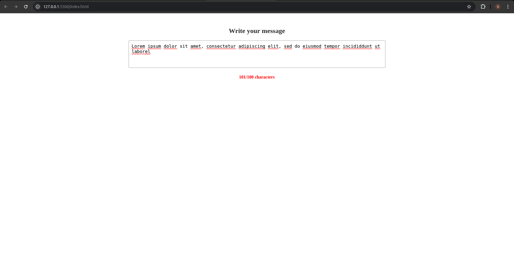

# Counter_App
## Date: 10/07/2025
## Objective:
To build a live character counter using JavaScript that dynamically displays the number of characters entered into a textarea — similar to what you see in Twitter or feedback forms.

## Tasks:

#### 1. Create the HTML Structure:
Add a ```<textarea>``` for user input.

Place a ```<div> or <p>``` below it to show the live character count.

Include a label or heading like “Write your message”.

#### 2. Style with CSS:
Center the layout using margin or flexbox.

Style the textarea with border, padding, and font size.

Style the counter to be bold and place it neatly below the input area.

#### 3. Add JavaScript Functionality:
Use addEventListener("input", ...) on the textarea.

Inside the function, get the length of the value (.value.length).

Update the counter element with this number in real time.

#### 4. Enhancements:
Set a maximum character limit (e.g., 100) and show remaining characters.

Change the text color if the user exceeds the limit.

Add emojis or icons using Unicode for visual feedback.
## HTML Code:
```html
<!DOCTYPE html>
<html lang="en">
<head>
  <meta charset="UTF-8">
  <meta name="viewport" content="width=device-width, initial-scale=1.0">
  <title>Live Character Counter</title>
  <link rel="stylesheet" href="styles.css">
</head>
<body>
  <div class="container">
    <h2>Write your message</h2>
    <textarea id="message" rows="4" cols="50" placeholder="Type here..."></textarea>
    <div id="counter" class="counter">0/100 characters</div>
  </div>
  <script src="script.js"></script>
</body>
</html>
```
## CSS Code:
```css
* {
    margin: 0;
    padding: 0;
    box-sizing: border-box;
  }
  
  .container {
    width: 50%;
    margin: 50px auto;
    text-align: center;
  }
  
  h2 {
    margin-bottom: 20px;
    font-size: 24px;
    color: #333;
  }

  textarea {
    width: 100%;
    padding: 10px;
    font-size: 16px;
    border: 2px solid #ccc;
    border-radius: 4px;
    resize: none;
    margin-bottom: 20px;
  }
  
  .counter {
    font-size: 16px;
    font-weight: bold;
    color: #333;
  }
  
  .counter.exceeded {
    color: red;
  }
```
## JS Code:
```js
const textarea = document.getElementById("message");
const counter = document.getElementById("counter");

const maxLength = 100;

textarea.addEventListener("input", function () {
  const currentLength = textarea.value.length;
  const remainingCharacters = maxLength - currentLength;

  counter.textContent = `${currentLength}/${maxLength} characters`;

  if (currentLength > maxLength) {
      counter.classList.add("exceeded");
      alert("Max Characters Reached!!");
  } else {
    counter.classList.remove("exceeded");
  }
    
});

```
## Output:



## Result:
A live character counter using JavaScript that dynamically displays the number of characters entered into a textarea — similar to what you see in Twitter or feedback forms is built successfully.
